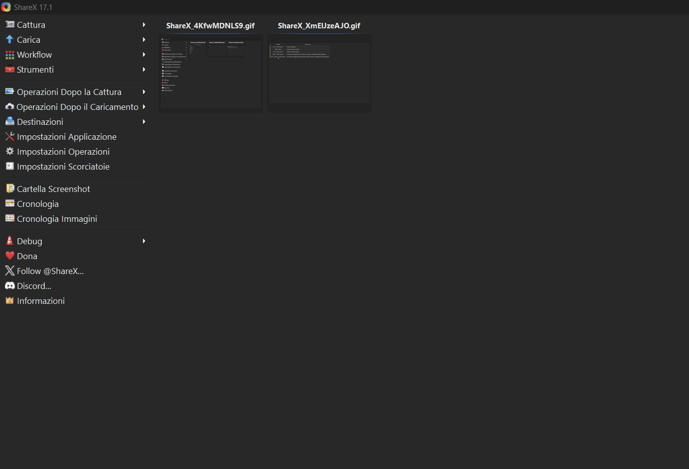

# MOCUCINO - PIATTAFORMA CULINARIA

Progetto di Ingegneria del Software a.a. 2024/2025, seguito dalla prof. A.R. Fasolino

## SPECIFICHE INFORMALI

Si desidera sviluppare un sistema software per la gestione di una piattaforma sociale dedicata alla condivisione di ricette culinarie semplici e veloci. La piattaforma è pensata per permettere agli utenti di pubblicare le proprie ricette, organizzarle in raccolte tematiche e interagire con i contenuti pubblicati dagli altri utenti attraverso apprezzamenti e commenti.

## TECNOLOGIE UTILIZZATE
- **IDE**: 
  - Intellij IDEA 2024.3.5
  - Eclipse IDE
- **Database**:
  - MySQL
- **Connettività DB**:
  - JDBC
- **Interfaccia Grafica**: 
  - JFrame
  - WindowBuilder
- **Testing**: 
  - JUnit 4

## DESCRIZIONE SISTEMA

Il sistema consente la registrazione degli utenti tramite l'inserimento di e-mail, nome, cognome e password. Ogni utente dispone di un profilo personale modificabile che include i propri dati anagrafici, una breve biografia ed eventualmente un'immagine del profilo. Dopo l'autenticazione, l'utente può pubblicare nuove ricette tramite un'apposita interfaccia grafica. Ogni ricetta è caratterizzata da un titolo, una lista di ingredienti, una descrizione dei passaggi (con un limite massimo di 800 caratteri), un tempo stimato di preparazione espresso in minuti, uno o più tag tematici (ad esempio "vegetariana", "dolci", "pranzo veloce"). L'utente può scegliere se aggiungere la ricetta a una raccolta già esistente oppure crearne una nuova al momento della pubblicazione.

Ogni raccolta è composta da ricette dello stesso autore, è identificata da un titolo e da una descrizione e può contenere ricette pubbliche o private. Le ricette pubbliche sono visibili nel feed principale degli utenti.

Una volta autenticato, ciascun utente può visualizzare nel proprio feed personale un insieme di nuove ricette pubblicate da altri utenti. Il feed mostra al massimo cinque ricette, ordinate in ordine cronologico decrescente, selezionate tra le ultime pubblicazioni effettuate da altri autori.

Gli utenti hanno la possibilità di interagire con le ricette pubblicate da altri tramite un sistema di apprezzamenti (rappresentati da un "like") e con l'aggiunta di commenti testuali. Ogni commento riporta l'autore, il testo e la data di pubblicazione. Quando una ricetta viene visualizzata, il sistema mostra anche il numero totale di like ricevuti e i tre commenti più recenti associati.

La piattaforma offre a ogni utente una sezione dedicata alle statistiche personali. In tale sezione l'utente può visualizzare il numero complessivo di like ricevuti dalle proprie ricette, il numero totale di commenti ottenuti e la ricetta più apprezzata tra quelle pubblicate, ossia quella con il numero più alto di like.

Gli amministratori della piattaforma, previa autenticazione, possono accedere a funzionalità di reportistica. Tali funzionalità consentono di generare report contenenti dati aggregati come il numero totale di ricette pubblicate in un determinato intervallo temporale, l'elenco degli autori più attivi in base al numero di ricette inserite, i tag tematici più utilizzati e le ricette con il maggior numero di interazioni.

Il sistema dovrà essere accessibile sia da dispositivi desktop che mobili, prevedere un sistema di notifiche in tempo reale per segnalare all'utente l'arrivo di nuovi commenti o apprezzamenti, garantire la protezione dei dati personali, la sicurezza delle informazioni archiviate e l'adozione di un meccanismo di autenticazione robusto e affidabile.
Il sistema dovrà essere accessibile sia da dispositivi desktop che mobili, prevedere un sistema di notifiche in tempo reale per segnalare all'utente l'arrivo di nuovi commenti o apprezzamenti, garantire la protezione dei dati personali, la sicurezza delle informazioni archiviate e l'adozione di un meccanismo di autenticazione robusto e affidabile.
